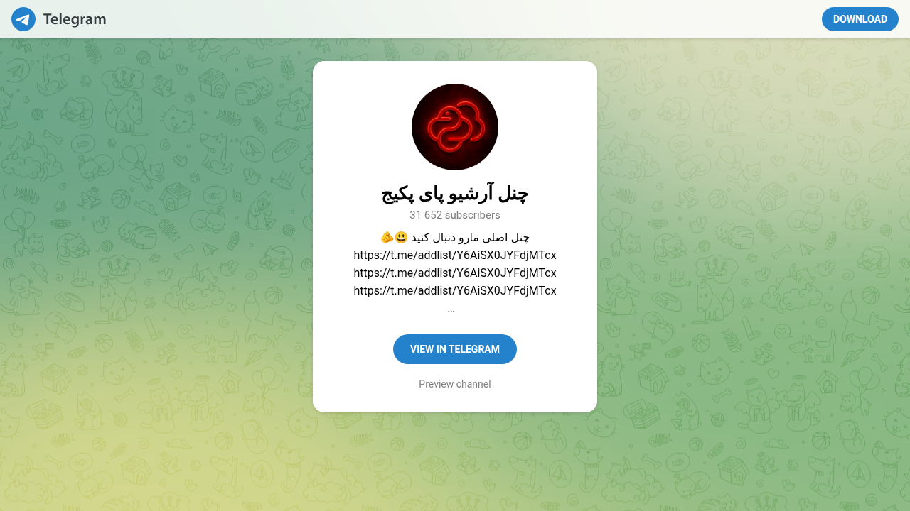

# Visited: https://t.me/pypackeges
**Time:** Wed May  6 17:56:53 UTC 2026

## Screenshot

## Raw HTML
[page.html](./page.html)

## Downloaded Media (4 files)
## Downloaded Media Files

- [favicon.ico](./media/favicon.ico) (14 KB)

## Other Links
- [//telegram.org/](//telegram.org/)
- [//telegram.org/css/bootstrap.min.css?3](//telegram.org/css/bootstrap.min.css?3)
- [//telegram.org/css/font-roboto.css?1](//telegram.org/css/font-roboto.css?1)
- [//telegram.org/css/telegram.css?249](//telegram.org/css/telegram.css?249)
- [//telegram.org/dl?tme=63c9a7adc0a0439702_8037642814796460669](//telegram.org/dl?tme=63c9a7adc0a0439702_8037642814796460669)
- [//telegram.org/img/website_icon.svg?4](//telegram.org/img/website_icon.svg?4)
- [//telegram.org/js/tgwallpaper.min.js?3](//telegram.org/js/tgwallpaper.min.js?3)
- [/css/myriad.css](/css/myriad.css)
- [/s/pypackeges](/s/pypackeges)
- [https://t.me/package_error](https://t.me/package_error)
- [tg://resolve?domain=pypackeges](tg://resolve?domain=pypackeges)

## Stats
- Links: 16
- Media: 4
